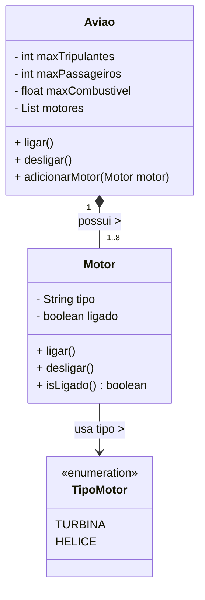

```mermaid
classDiagram
    class Aviao {
        - int maxTripulantes
        - int maxPassageiros
        - float maxCombustivel
        - List<Motor> motores
        + ligar()
        + desligar()
        + adicionarMotor(Motor motor)
    }

    class Motor {
        - String tipo
        - boolean ligado
        + ligar()
        + desligar()
        + isLigado() boolean
    }

    class TipoMotor {
        <<enumeration>>
        TURBINA
        HELICE
    }

    Aviao "1" *-- "1..8" Motor : possui >
    Motor --> TipoMotor : usa tipo >

```